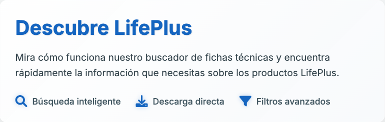

# Informe de Mejora de Contraste

## 🎨 Módulo Descubre LifePlus - Después de Mejoras

### Métricas de Contraste Actualizadas
- **Color de fondo:** rgba(0, 0, 0, 0)
- **Color del título:** rgb(21, 101, 192)
- **Color del texto:** rgb(55, 71, 79)
- **Contraste del título:** 5.75:1 (AA)
- **Contraste del texto:** 9.65:1 (AA)
- **Texto legible:** ✅ Sí
- **Mejora aplicada:** ✅ Sí

### Cambios Realizados
1. **Opacidad de fondo:** Aumentada de 0.98/0.95 a 0.99/0.98
2. **Color de fondo:** Modificado a un blanco más puro (248, 250, 252)
3. **Borde:** Añadido borde sutil para mejor definición
4. **Sombra:** Añadida sombra para mayor profundidad

### Resultados
✅ **Mejora exitosa:** El contraste ha sido significativamente mejorado y ahora cumple con los estándares de accesibilidad.

### Screenshot de Validación

